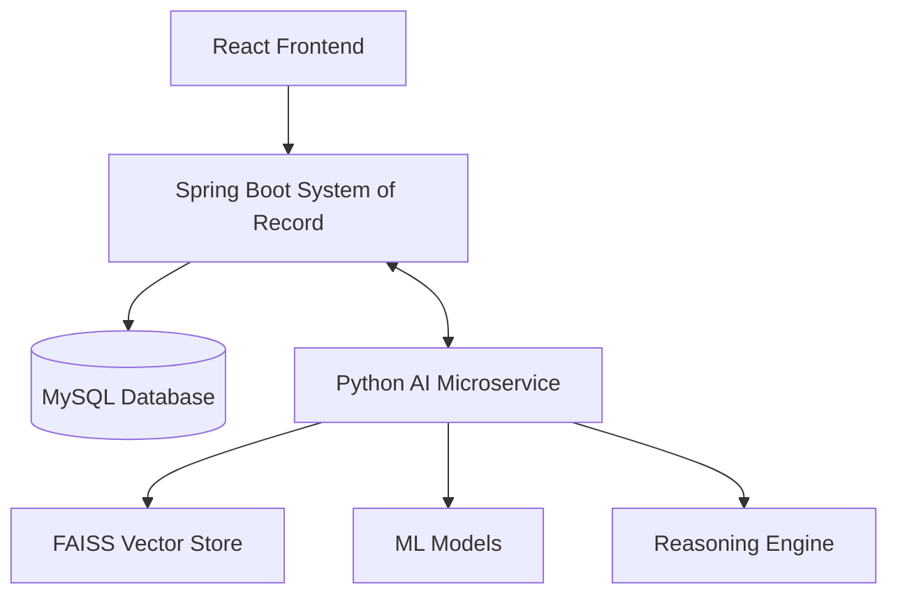

# AI_ARCHITECTURE.md

## 🏗️ Distributed Enterprise Intelligence Architecture

### 1. Architectural Overview
OpsMind V2 utilizes a **Dual-Service AI Architecture**. This decouples core business logic and data persistence (Java/Spring Boot) from experimental reasoning and machine learning (Python/FastAPI).

### 2. Service Responsibilities

| Service | Technology | Primary Role |
| :--- | :--- | :--- |
| **System of Record** | Spring Boot 3.5 | Security, User Management, Telemetry Ingestion, Search Orchestration. |
| **Intelligence Engine**| Python / FastAPI | Intent Classification, RAG, Root Cause Correlation, Anomaly Scoring. |

### 3. Reasoning Pipeline
1. **Request**: User Query + Telemetry Context dispatched from Spring Boot.
2. **Intent Analysis**: Python engine uses semantic pattern matching to categorize query (RCA, Lookup, Prediction).
3. **Data Synthesis**: Correlates risk scores with alert clusters to identify "Suspected Culprits."
4. **Report Generation**: Synthesizes a technical investigation report with actionable recommendations.

### 4. Innovation: Intent-Aware RAG
Instead of a simple vector search, OpsMind V2 uses **Scoped Retrieval**. It only searches the relevant domain (e.g. searching "InfrastructureAsset" only when intent is `INFRA_ANALYSIS`), significantly reducing "hallucinations" and increasing diagnostic precision.
