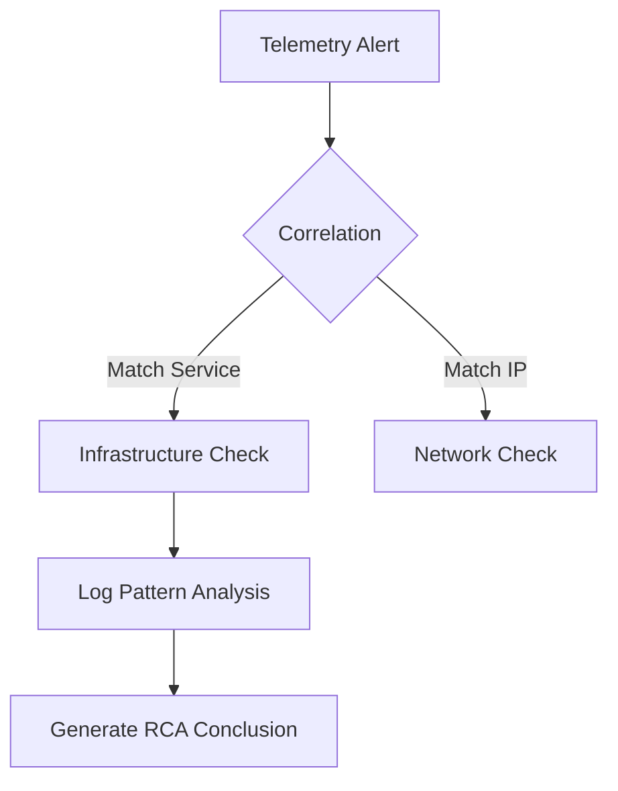

# AI_REASONING_ENGINE.md

## 🧠 OpsMind SRE Reasoning Logic

### 1. Root Cause Analysis (RCA) Logic
The engine uses a "Trigger-Context-Evidence" (TCE) chain to analyze failures.

### 2. Logic Branches

#### A. Service Degradation
- **Input**: Latency Alert > Threshold.
- **Reasoning**: If `DB_CONNECTION_WAIT` alert exists AND `CPU_LOAD` is low -> **Conclusion**: Connection Pool Exhaustion.
- **Reasoning**: If `5xx_ERROR_RATE` alert exists AND `RECENT_DEPLOYMENT` exists -> **Conclusion**: Regressive Deployment.

#### B. Infrastructure Failure
- **Input**: Node Status != HEALTHY.
- **Reasoning**: If `HEALTH_CHECK_TIMEOUT` AND `IP_REACHABLE` is false -> **Conclusion**: Zombie Node / Cloud Provider Outage.
- **Recommendation**: Trigger automated reconciliation.

### 3. Contextual Data Access
The reasoning engine has direct, low-latency access to the following schemas:
- **AlertRepository**: For real-time signals.
- **IncidentRepository**: For human-validated outage tracking.
- **InfrastructureRepository**: For hardware/cloud state.
- **SecurityFindingRepository**: For threat correlation.
