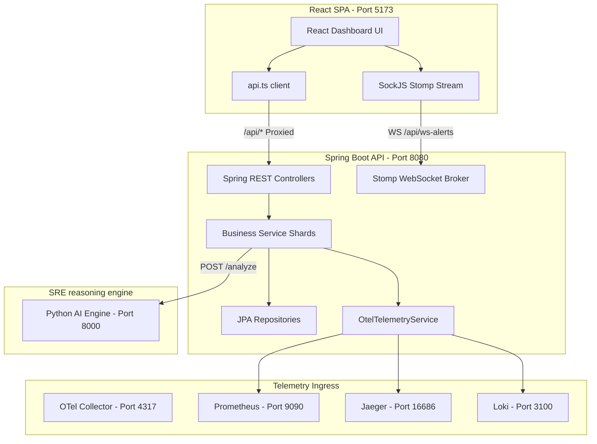

# OpsMind — Complete Website Feature & UI Integration Guide

Welcome to the OpsMind Operational Blueprint. This guide serves as the definitive source of truth for the entire OpsMind application, covering the frontend React dashboard, Spring Boot backend REST APIs, Prometheus/Jaeger/Loki telemetry flows, database JPA schemas, and click-by-click demo scenarios.

---

## 1. Application Architecture & UI Walkthrough

OpsMind is organized into a modular React single-page application (SPA) backed by a Spring Boot REST API, a STOMP WebSocket server, and a FastAPI-based AI Reasoning Engine.



### 1.1 Ingress & Routing Structure
* **Application Boot**: Managed in [main.tsx](file:///d:/Project/frontend/src/main.tsx) wrapping [App.tsx](file:///d:/Project/frontend/src/App.tsx) inside a React Query `QueryClientProvider` and React Router.
* **Layout Wrappers**:
  * **AuthLayout.tsx**: Renders onboarding, login, and registration screens in a clean, centered container.
  * **AppLayout.tsx**: Renders the authenticated command shell, containing the sidebar navigation, top header breadcrumbs, user profile context, and notifications panel.
* **Routing Table**:
  * `/login` (Public) - [LoginPage.tsx](file:///d:/Project/frontend/src/pages/LoginPage.tsx)
  * `/register` (Public) - [RegisterPage.tsx](file:///d:/Project/frontend/src/pages/RegisterPage.tsx)
  * `/onboarding` (Public) - [SetupWizard.tsx](file:///d:/Project/frontend/src/pages/SetupWizard.tsx)
  * `/dashboard` (Protected) - [DashboardPage.tsx](file:///d:/Project/frontend/src/pages/DashboardPage.tsx)
  * `/incidents` (Protected) - [IncidentsPage.tsx](file:///d:/Project/frontend/src/pages/IncidentsPage.tsx)
  * `/alerts` (Protected) - [AlertsPage.tsx](file:///d:/Project/frontend/src/pages/AlertsPage.tsx)
  * `/ai-chat` (Protected) - [AiChatPage.tsx](file:///d:/Project/frontend/src/pages/AiChatPage.tsx)
  * `/ai-insights` (Protected) - [AiInsightsPage.tsx](file:///d:/Project/frontend/src/pages/AiInsightsPage.tsx)
  * `/analytics` (Protected) - [AnalyticsPage.tsx](file:///d:/Project/frontend/src/pages/AnalyticsPage.tsx)
  * `/infrastructure` (Protected) - [InfrastructurePage.tsx](file:///d:/Project/frontend/src/pages/InfrastructurePage.tsx)
  * `/security` (Protected) - [SecurityPage.tsx](file:///d:/Project/frontend/src/pages/SecurityPage.tsx)
  * `/integrations` (Protected) - [IntegrationsPage.tsx](file:///d:/Project/frontend/src/pages/IntegrationsPage.tsx)
  * `/settings` (Protected) - [SettingsPage.tsx](file:///d:/Project/frontend/src/pages/SettingsPage.tsx)

### 1.2 Layout Core Navigation Component
The sidebar navigation is managed in [Sidebar.tsx](file:///d:/Project/frontend/src/components/Sidebar.tsx). It displays the tenant brand organization switcher, a quick navigation filter search bar, and grouping links:
1. **Operational**: Dashboard, Incidents, Alert Stream.
2. **Intelligence**: AI Copilot, Insights, Analytics.
3. **Infrastructure**: Service Map, Security, Integrations, Settings.
4. **Context Control**: User card details (Avatar, SRE Name, Role) and collapse/expand toggles.

---

## 2. Feature-by-Feature State Audit

This audit classifies each UI dashboard feature into one of four states:
* **REAL**: Integrated with real database transactions, live APIs, or actual target service telemetry.
* **PARTIALLY REAL**: Connected to the database, but displaying mock indicators, labels, or utilizing simulated downstream delays.
* **MOCK/STATIC**: Static layout elements or client-side random number generations.
* **BROKEN**: Feature paths that crash, are non-functional, or are not bound to endpoints.

| Feature Area | Component/Action | State | Technical Logic & Files |
| :--- | :--- | :--- | :--- |
| **Telemetry Ingress** | requestCount / requestRate | **REAL** | Pulled from target Prometheus metrics via [OtelTelemetryService.java](file:///d:/Project/backend/src/main/java/com/opsmind/service/OtelTelemetryService.java). |
| **Telemetry Ingress** | latencyMs / errorCount | **REAL** | Dynamic aggregation query calculated via Prometheus `increase` functions and status logs in Loki. |
| **Telemetry Ingress** | Distributed Traces Table | **REAL** | RestTemplate query parsing JSON traces payload from Jaeger at port 16686. |
| **Telemetry Ingress** | Application Log Streams | **REAL** | Querying range parameters on Loki Loki query range APIs (`{service_name="monitored-service"}`). |
| **Dashboard Stats** | Availability Metric | **REAL** | Nominally `99.98%`, transitions to `Degraded` status dynamically if metric history CPU usage > 95%. |
| **Dashboard Stats** | Active Incidents Count | **REAL** | Counts open incidents where `status != 'RESOLVED'` using JPA repository hooks. |
| **Dashboard Stats** | Performance Series Chart | **REAL** | Recharts Area plot displaying historical metrics fetched chronologically from `SystemMetricRepository`. |
| **Dashboard HUD** | Extend HUD Modal | **MOCK** | Modal opens with resource types, but clicks only trigger simulated dialog closes. |
| **Incidents Triage** | Advanced Search & Filters | **REAL** | Leverages custom database specifications to filter incidents by status, severity, and text query matching. |
| **Incidents Triage** | Declare Incident Modal | **REAL** | Stores new incidents in the database with configurable title, service, environment, and priority. |
| **Incidents Triage** | Detail Drawer Status Transitions | **REAL** | Submits state transitions (Acknowledge, Resolve) to [IncidentController.java](file:///d:/Project/backend/src/main/java/com/opsmind/controller/IncidentController.java). |
| **Incidents Triage** | Incident Timeline & Activity Log | **PARTIALLY REAL** | Displays automated telemetry creation history, but the responder chat thread is simulated. |
| **Incidents Triage** | Bulk Actions | **REAL** | Clicks resolve bulk records via `POST /api/incidents/bulk-resolve`. |
| **Alert Stream** | WebSocket Signal Toast | **REAL** | Subscribes to SockJS `/topic/alerts` using STOMP client to display sonner notifications on live telemetry alerts. |
| **Alert Stream** | Individual Acknowledgement | **REAL** | Calls `/api/alerts/{id}/acknowledge` and updates persistence database mapping. |
| **Alert Stream** | Acknowledge All Button | **MOCK** | Renders in sidebar toolbar, but does not invoke a bulk-acknowledgement transaction. |
| **AI SRE Copilot** | Conversation List Control | **REAL** | Implements chat conversation creation, renaming, deletion, pinning, and archiving in the SQLite database. |
| **AI SRE Copilot** | Prompt Injection Stream | **REAL** | Uses Spring WebMvc `SseEmitter` thread-safely to stream tokens from the FastAPI reasoning engine with prompt history context. |
| **Predictive Insights** | Health & Confidence Metrics | **MOCK** | Static HUD metrics display static numeric labels (`98.2`, `94.5%`). |
| **Predictive Insights** | Recommendation Matrix | **REAL** | Dynamic listings from database predictions using `apiClient.getAiInsights()`. |
| **Predictive Insights** | Recommendation Remediation | **PARTIALLY REAL** | Clicks initiate loading sequences via sonner toasts representing patching steps, but do not execute server scripts. |
| **Performance Analytics**| MTTR / Fleet health charts | **REAL** | Charts rendering historical trend sets fetched from `/api/analytics/trends`. |
| **Service Map (Infra)** | Cluster Scan Activation | **REAL** | Triggers asset generation in database, mapping discovered nodes dynamically. |
| **Security HUD** | High-Risk Alert Counts | **REAL** | Calculates length of elements in database containing `severity = 'HIGH'`. |
| **Security HUD** | Deep Scan Activation | **REAL** | Saves initial target system kernel vulnerabilities into the database. |
| **Settings** | User profile & Uploads | **REAL** | Updates User attributes, uploads images to `/api/storage/upload` storing public assets. |
| **Settings** | Squad Management | **REAL** | Populates workspace staff directory and revokes permissions via `DELETE /api/users/{id}`. |
| **Settings** | Password Rotation | **REAL** | Rotates encryption hashes in Spring Security filter mappings. |
| **Settings** | System Audit Log Table | **REAL** | Renders cryptographically signed record of all system events from `AuditLogRepository`. |

---

## 3. Backend API Route Specification

The Spring Boot backend controller routes are mapped under `/api` path. They are secured using JSON Web Tokens (JWT) inside Spring Security filters, except for `/api/auth/**`, `/api/ai/**` (copilot permitted endpoint), and public asset static mappings.

### 3.1 Authentication Controller
* **Location**: [AuthController.java](file:///d:/Project/backend/src/main/java/com/opsmind/controller/AuthController.java)
* **API Route Map**:
  * `POST /api/auth/register`: Create a new SRE account and default organization.
  * `POST /api/auth/login`: Issue Access token and Refresh token validation payloads.
  * `POST /api/auth/logout`: Revoke active session tokens.
  * `POST /api/auth/refresh`: Re-issue expired SRE access tokens.
  * `POST /api/auth/password/change`: Change password mapping.

### 3.2 User Management Controller
* **Location**: [UserController.java](file:///d:/Project/backend/src/main/java/com/opsmind/controller/UserController.java)
* **API Route Map**:
  * `GET /api/users/me`: Fetch authenticated SRE identity details.
  * `PUT /api/users/me`: Synchronize profile configurations (First name, last name, title, department, avatar image).
  * `GET /api/users`: List all active organization operators.
  * `DELETE /api/users/{id}`: Revoke SRE cluster access.

### 3.3 Incidents & Triage Controller
* **Location**: [IncidentController.java](file:///d:/Project/backend/src/main/java/com/opsmind/controller/IncidentController.java)
* **API Route Map**:
  * `GET /api/incidents`: Fetch raw incidents (optionally filter by `organizationId`, `status`, `severity`).
  * `GET /api/incidents/search`: Paginated, sorted advanced specification queries (page, size, query keyword parameter).
  * `POST /api/incidents`: Declare a new operational crisis.
  * `GET /api/incidents/{id}/timeline`: Retrieve timestamped timeline narrative logs.
  * `PUT /api/incidents/{id}/status`: Set incident state (`status`, `note`, `operator`).
  * `POST /api/incidents/{id}/acknowledge`: Set incident state to `ACKNOWLEDGED`.
  * `POST /api/incidents/{id}/resolve`: Resolve incident with commentary (saves resolution time to compute MTTR metrics).
  * `POST /api/incidents/bulk-resolve`: Resolves a list of incident IDs.

### 3.4 Telemetry Stream Controllers
* **Location**: [TelemetryController.java](file:///d:/Project/backend/src/main/java/com/opsmind/controller/TelemetryController.java), [SummaryController.java](file:///d:/Project/backend/src/main/java/com/opsmind/controller/SummaryController.java)
* **API Route Map**:
  * `GET /api/telemetry/realtime`: Fetch Prometheus/Jaeger/Loki snapshots for the target service.
  * `GET /api/summary/stats`: Pull Availability status, MTTR calculation, Active counts, CPU metric series, and risk vectors.

### 3.5 AI Copilot Controller
* **Location**: [AiController.java](file:///d:/Project/backend/src/main/java/com/opsmind/controller/AiController.java)
* **API Route Map**:
  * `GET /api/ai/conversations`: Load conversations.
  * `POST /api/ai/conversations`: Instantiate empty chat thread.
  * `GET /api/ai/conversations/{id}/messages`: Fetch full historical message lists.
  * `POST /api/ai/conversations/{id}/stream` (`text/event-stream`): Eagerly materialize message history arrays to prevent `LazyInitializationException` and stream LLM responses from Python SRE engine.
  * `PATCH /api/ai/conversations/{id}/rename`: Rename chat title.
  * `DELETE /api/ai/conversations/{id}`: Delete conversation history.
  * `POST /api/ai/conversations/{id}/pin`: Toggle pin/unpin conversation.
  * `POST /api/ai/conversations/{id}/archive`: Toggle archive conversation.
  * `GET /api/ai/insights`: Fetch AI recommended optimizations.

### 3.6 Infrastructure, Security, & Asset Controllers
* **Location**: [InfrastructureController.java](file:///d:/Project/backend/src/main/java/com/opsmind/controller/InfrastructureController.java), [SecurityController.java](file:///d:/Project/backend/src/main/java/com/opsmind/controller/SecurityController.java), [ExportController.java](file:///d:/Project/backend/src/main/java/com/opsmind/controller/ExportController.java)
* **API Route Map**:
  * `GET /api/infrastructure/assets`: Fetch multi-region cluster inventory.
  * `POST /api/infrastructure/scan`: Discovers new infrastructure assets.
  * `GET /api/security/findings`: Load vulnerabilities.
  * `POST /api/security/scan`: Scans systems for compliance.
  * `GET /api/export/{module}`: Download structured operational CSV tables (incidents, alerts, infrastructure, audit, analytics, security).

---

## 4. Telemetry Pipeline Flow Map

The target Spring Boot microservice is monitored via an end-to-end telemetry pipeline.

```
Target Microservice (Port 8081)
  │ (OTel Java Agent auto-instruments HTTP requests, logs, traces)
  ▼
OpenTelemetry Collector (gRPC Ingestion - Port 4317)
  ├── Exposes Prometheus scrapable endpoint (Port 8889) ──> Prometheus Server (Scrapes - Port 9090)
  ├── Forwards Traces via OTLP ────────────────────────────> Jaeger Query Server (Port 16686)
  └── Forwards Application Logs via OTLP ──────────────────> Loki Log Gateway (Port 3100)
                                                                 │
                                                                 ▼
                                                  Spring Boot Backend (Port 8080)
                                                   └─ OtelTelemetryService.java 
                                                         │
                                                         ▼
                                                  React UI Dashboard (Port 5173)
                                                   └─ apiClient.getRealtimeTelemetry()
```

### 4.1 Prometheus Metric Queries
The backend service polls these Prometheus queries to retrieve live target metrics:
* **Throughput**: `sum(rate(opsmind_http_server_request_duration_seconds_count{exported_job="monitored-service"}[1m]))`
* **Total Requests**: `sum(opsmind_http_server_request_duration_seconds_count{exported_job="monitored-service"})`
* **Latency ms**: `(sum(increase(opsmind_http_server_request_duration_seconds_sum{exported_job="monitored-service"}[1m])) / sum(increase(opsmind_http_server_request_duration_seconds_count{exported_job="monitored-service"}[1m]))) * 1000.0`
* **5xx Errors**: `sum(opsmind_http_server_request_duration_seconds_count{exported_job="monitored-service", http_response_status_code=~"5.."})`

### 4.2 Distributed Tracing & Logging Integrations
* **Jaeger Query REST**: The backend polls `/api/traces?service=monitored-service&limit=15` on `http://localhost:16686`. It maps span tags such as `error=true` to highlight faulty trace cycles.
* **Loki Log Range Queries**: The backend queries `/loki/api/v1/query_range` using `{service_name="monitored-service"}` logs filtering. It parses line patterns containing keywords (`ERROR`, `WARN`, `Exception`) to assign log levels.

---

## 5. Database Schema & JPA Entity Mapping

OpsMind persistence is backed by a relational database schema. Below are the key JPA models located in [com.opsmind.model](file:///d:/Project/backend/src/main/java/com/opsmind/model/):

### 5.1 Incident Entity
Represents an incident record.
* **JPA Class**: `Incident`
* **Columns**:
  * `id` (Long, PK): Auto-incremented sequence identifier.
  * `title` (String): Diagnostic identifier name of the outage.
  * `severity` (String): Urgency status code (`P1` critical, `P2` major, `P3` minor).
  * `priority` (String): Response tier priority (`HIGHEST`, `HIGH`, `LOW`).
  * `serviceName` (String): Target service scope.
  * `description` (String): Response instruction briefing text.
  * `status` (String): Action lifecycle state (`OPEN`, `ACKNOWLEDGED`, `RESOLVED`).
  * `createdAt` (LocalDateTime): Date incident opened.
  * `resolvedAt` (LocalDateTime): Date incident closed (used to calculate MTTR).
  * `resolution` (String): Diagnostic commentary explaining the patch.
  * `metricValue` (Double): Value of the metric that triggered the incident.
  * `threshold` (Double): Operational limit threshold value.
  * `type` (String): Anomaly category flag (`HIGH_ERROR_RATE`, etc.).

### 5.2 Alert Entity
Represents individual alert events.
* **JPA Class**: `Alert`
* **Columns**:
  * `id` (Long, PK): Sequence identifier.
  * `alertName` (String): Unique identifier alert name.
  * `message` (String): Analytical detail description.
  * `severity` (String): Severity indicator (`CRITICAL`, `WARNING`, `INFO`).
  * `status` (String): Alert lifecycle state (`TRIGGERED`, `ACKNOWLEDGED`, `RESOLVED`).
  * `source` (String): Generating client (`CloudWatch/Prometheus`).
  * `timestamp` (LocalDateTime): Ingress notification date.

### 5.3 AI Conversation Memory Entities
Maintains context history for the SRE Copilot.
* **JPA Class**: `Conversation`
  * Represents a chat session.
  * **Columns**:
    * `id` (Long, PK): Chat conversation identity ID.
    * `title` (String): Thread title description.
    * `pinned` (Boolean): Persistent interface grouping toggle.
    * `archived` (Boolean): Workspace archival indicator.
    * `createdAt` (LocalDateTime): Conversational date creation.
  * **Relationships**:
    * One-to-Many: `@OneToMany(mappedBy = "conversation", cascade = CascadeType.ALL)` links to `ChatMessage` list.
* **JPA Class**: `ChatMessage`
  * Represents individual chat messages.
  * **Columns**:
    * `id` (Long, PK): Message primary index.
    * `role` (String): Generating speaker tag (`user`, `assistant`).
    * `content` (String, Lob): Text query inputs or typewriter markdown logs content.
    * `timestamp` (LocalDateTime): Text message delivery timestamp.
  * **Relationships**:
    * Many-to-One: `@ManyToOne` links back to `Conversation` parent entity.

---

## 6. End-to-End Operational Demo Scenarios

Use this click-by-click guide to demonstrate OpsMind's capabilities during a live walkthrough.

### Scenario A: Telemetry & Monitoring
1. Log into `http://localhost:5173/login`. Use credentials:
   * **Organization ID**: `default`
   * **Email**: `sre@opsmind.com`
   * **Password**: `password`
2. Look at the lower section of the dashboard under **Target Microservice: monitored-service**.
3. Verify that the **Total Request Count** and **Active Request Rate** are dynamically updating every 3 seconds.
4. Check the **Recent Distributed Traces** list to confirm Jaeger is streaming traces.
5. Check the terminal-style **Live Application Log Streams** panel to verify Loki log ingestion.

### Scenario B: High Error-Rate Outage & Auto-Resolution
1. Run a script or use an API to trigger high error rate traffic (e.g., requests to `http://localhost:8081/api/error`).
2. Watch the Dashboard. Within 5-10 seconds, the **Active Request Rate** and **HTTP Error Count** will surge.
3. Once the error rate exceeds the 10% threshold, a critical incident banner will appear at the top of the monitored-service dashboard:
   * **Active Incident**: `High HTTP Error Rate detected on monitored-service`
   * **Severity**: `P1`
   * **Metric**: `XX.XX%`
4. Click the **Investigate** button on the banner to open the Incident Room.
5. In the Incident Details drawer:
   * Review the **Signal Progression** indicator status (`OPEN`).
   * Read the description details, metric values, and threshold parameters.
   * Click **Acknowledge** to mark the incident as `ACKNOWLEDGED`.
6. Go back to the dashboard or send healthy traffic (e.g. requests to `http://localhost:8081/api/hello`).
7. Once the error rate drops below 10%, the backend will trigger an auto-resolution.
8. The dashboard banner will turn green and display:
   * `The high error rate incident was auto-resolved. HTTP error rate is healthy at XX.XX%...`

### Scenario C: AI SRE Copilot Root Cause Analysis
1. Navigate to **AI Copilot** in the sidebar.
2. Click the suggested prompt button: **"Analyze active incidents and their root cause"**.
3. Watch the assistant response stream in real-time. It query the active incidents database, analyze the Prometheus metrics payload, and output a detailed SRE analysis report.
4. Next, ask the Copilot: **"What is the system status and resource availability?"**.
5. The Copilot will analyze target telemetry records and reply with active infrastructure metrics, latency profiles, and diagnostic logs.

### Scenario D: System Audit & Security Scan
1. Navigate to **Security** page.
2. Observe the current High-Risk findings count. Click **Deep Scan**.
3. A sonner toast notification will report `Security scan finalized. X patterns identified.`, and the tables will populate with findings.
4. Navigate to **Settings** and click the **Audit Log** tab.
5. Review the historical logs, verifying that actions like `Deep Scan` or `Incident Declared` have been recorded.
6. Click **Export Logs** to download the signed CSV audit sheet.

---

## 7. Troubleshooting & Operator Runbook

Use this section to diagnose and fix issues with the OpsMind environment.

### 7.1 Port Mapping Reference
If a service fails to start, verify that the following ports are open:
* **Vite React Frontend**: `5173` (Proxies requests to `http://localhost:8080`)
* **Spring Boot Backend**: `8080` (Standard REST API, STOMP Websocket server)
* **Monitored Microservice**: `8081` (Spring Boot target microservice)
* **Python SRE Engine**: `8000` (FastAPI core reasoning engine)
* **Prometheus Server**: `9090` (Scrapes collector metrics)
* **Jaeger Query/UI**: `16686` (Distributed tracing browser client)
* **Loki Gateway**: `3100` (Application logs database)
* **OTel Collector**: `4317` (gRPC receiver) / `4318` (HTTP receiver)

### 7.2 OutOfMemory / JVM Startup Failures (DOS Error 1455)
> [!WARNING]
> On Windows systems with limited virtual memory allocation, launching multiple Spring Boot JVMs concurrently can crash the JVM with:
> `Java HotSpot(TM) 64-Bit Server VM warning: INFO: os::commit_memory(...) failed; error='The paging file is too small for this operation to complete'`

**Remediation Steps**:
1. Check for orphaned Java processes running in the background. Open PowerShell as Administrator and run:
   ```powershell
   Get-Process java | Stop-Process -Force
   ```
2. Reduce the memory allocation flags when running the JARs. For example, add `-Xms128m -Xmx512m` to the execution command:
   ```powershell
   java -Xms128m -Xmx512m -jar target/opsmind-backend-0.0.1-SNAPSHOT.jar
   ```

### 7.3 STOMP WebSocket Connection Failures
If you see console errors stating `STOMP: Connect failed...`:
* Verify that the backend is active on port `8080`.
* Check CORS configuration in [SecurityConfiguration.java](file:///d:/Project/backend/src/main/java/com/opsmind/security/SecurityConfiguration.java) or verify client environment variables in `vite.config.ts`.
* In [useAlertStream.ts](file:///d:/Project/frontend/src/hooks/useAlertStream.ts), ensure that the STOMP endpoint points to `http://localhost:8080/api/ws-alerts`.

### 7.4 Database Reset Instructions
To wipe the database schema and re-initialize it to a clean state:
1. Stop the backend server process.
2. Delete the local SQLite database file at `backend/opsmind.db`.
3. Start the backend application. Spring Boot Hibernate auto-ddl configurations will re-create all tables.
4. Run a cluster scan from the **Infrastructure** panel to re-populate nodes.
